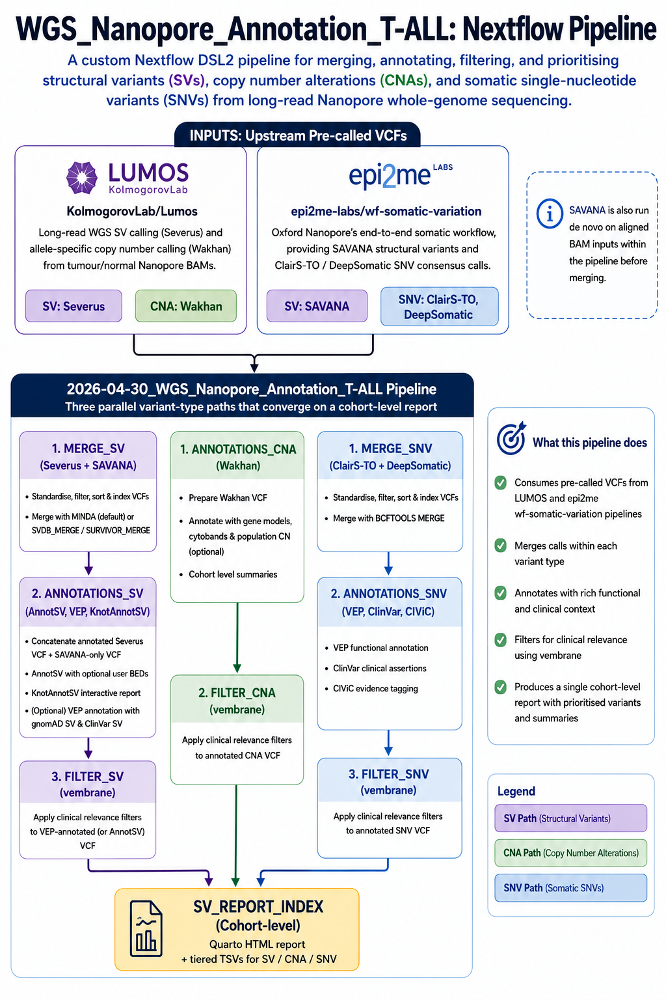

# WGS Nanopore Annotation

A Nextflow DSL2 pipeline for merging, annotating, filtering, and prioritising **structural variants (SVs)**, **copy number alterations (CNAs)**, and **somatic single-nucleotide variants (SNVs)** from long-read Nanopore whole-genome sequencing. Developed for T-ALL cancer genomics at the Quintarelli and Locatelli laboratories at Ospedale Bambino Gesu.

## Overview

Input VCFs are produced upstream by two nf-core-style pipelines that this workflow consumes directly:

- **[KolmogorovLab/Lumos](https://github.com/KolmogorovLab/Lumos)** — long-read WGS SV calling (Severus) and allele-specific copy number calling (Wakhan) from Nanopore BAMs. This cohort is **tumour-only** (no matched normal), so somatic status is not established by subtracting a matched normal; it is inferred downstream from population allele frequency (gnomAD-SV), clinical evidence (ClinVar, AnnotSV ACMG), and single-haplotype read support. That premise is what the SV/CNA/SNV filtering strategy below is built around.
- **[epi2me-labs/wf-somatic-variation](https://github.com/epi2me-labs/wf-somatic-variation)** — Oxford Nanopore's end-to-end somatic workflow, providing SAVANA structural variants and ClairS-TO / DeepSomatic SNV consensus calls.

The pipeline then runs three parallel variant-type paths — SV, CNA, SNV — each with its own merge → annotate → filter → prioritise chain that converges on a single cohort-level Quarto report / Interactive dashboard:



---

## Subworkflows

A parallel flow is used for all three variant types (SV, CNA, SNV): (i) merge / consensus across per-caller VCFs, (ii) annotate with knowledge bases + prediction tools, (iii) vembrane-based filtering with driver-tier prioritization, (iv) render into the cohort dashboard.

| Variant type | Merge / consensus | Annotate | Filter | Report |
|---|---|---|---|---|
| SV  | MERGE_SV + MINDA_ANNOTATIONS | ANNOTATIONS_SV  | FILTER_SV  | SV_REPORT_INDEX |
| CNA | Wakhan Only    | ANNOTATIONS_CNA | FILTER_CNA | SV_REPORT_INDEX |
| SNV | MERGE_SNV                    | ANNOTATIONS_SNV | FILTER_SNV | SV_REPORT_INDEX |

### MERGE_SV

Prepares and merges the per-caller VCFs:

1. `BCFTOOLS_REHEADER` — standardise sample headers
2. `BCFTOOLS_VIEW` / `BCFTOOLS_SORT` / `BCFTOOLS_INDEX` — filter, sort, and index each caller VCF
3. Merge with one of:
   - **MINDA** (default) — ensemble merging with CALLER-aware consensus


### MINDA_ANNOTATIONS

Cross-references the MINDA ensemble VCF with the original per-caller VCFs to produce two outputs used downstream:

- **Annotated Severus VCF** — carries `CALLER`, `SAVANA_ID`, `SAVANA_SVTYPE`, `SAVANA_POS`, `SAVANA_END`, `SAVANA_CHR2`, `SAVANA_POS2`, `SAVANA_MATEID` INFO fields annotated from the MINDA overlap
- **SAVANA-only VCF** — calls present in SAVANA but absent from the MINDA ensemble (sorted and indexed)

The `CALLER` field values are:
| Value | Meaning |
|-------|---------|
| `MINDA` | Call supported by both Severus and SAVANA |
| `SEVERUS` | Severus-only call |
| `SAVANA` | SAVANA-only call (in the SAVANA-only VCF) |

### ANNOTATIONS_SV

1. **Concatenate** annotated Severus VCF + SAVANA-only VCF (`BCFTOOLS_CONCAT`)
2. **Sort + index** the merged VCF
3. **AnnotSV** annotation — structural variant annotation with optional user-supplied BED files (FtIncludedInSV / SVincludedInFt / AnyOverlap overlap categories); see [User BED annotations](#user-bed-annotations) below
4. **KnotAnnotSV** — interactive HTML (or `.xlsm`) report from the AnnotSV TSV output
5. **ENSEMBLVEP_VEP** (optional) — VEP annotation of the AnnotSV VCF with `--custom` gnomAD SV and ClinVar SV overlaps; requires either a local cache path (`--vep_cache`) or `include_cache = true` to auto-download

### FILTER_SV

Applies a clinical relevance filter to the VEP-annotated VCF (or the AnnotSV VCF when VEP is not configured) using [vembrane](https://github.com/vembrane/vembrane).

**Hard filters** (all must pass):

| Filter | Field | Criterion |
|--------|-------|-----------|
| Precise breakpoints | `PRECISE` flag | Must be present |
| Not benign | `ACMG_class` | Not class 1 (benign) or class 2 (likely benign) |
| gnomAD population frequency | `ANN["gnomAD_SV_AF"]` (VEP CSQ) | All overlapping gnomAD SVs must have AF < 10% |

**Inclusion criteria** (at least one must be true):

| Criterion | Field |
|-----------|-------|
| Consensus call (Severus + SAVANA) | `CALLER == "MINDA"` |
| VUS or higher | `ACMG_class` 3, 4, or 5 |
| Pathogenic in AnnotSV databases | `P_gain_source`, `P_loss_source`, or `P_ins_source` non-empty |
| ClinVar pathogenic | `ANN["ClinVar_SV_CLNSIG"]` contains "Pathogenic" |
| T-ALL cohort SV overlap | `name_ST17_*` INFO field non-empty (user BED annotations) |
| COSMIC somatic SV | `Cosmic_ID` non-empty |

Additional per-record refinements: 
 * hVAF haplotype-imbalance filter
 * Tier-3 MINDA-only rescue (T3 records must have consensus support unless they overlap an ST17 BED region). 
 * When VEP is not configured the gnomAD and ClinVar checks are omitted and vembrane filters on AnnotSV INFO fields only.

Output: bgzipped, tabix-indexed filtered VCF (`*.merged.annotated.filtered.pass2.vcf.gz`) plus a vembrane-derived TSV table.

### ANNOTATIONS_CNA

Mirrors ANNOTATIONS_SV for the Wakhan CNV VCF:

1. `BCFTOOLS_REHEADER` — standardise sample header to `meta.id`
2. `BCFTOOLS_RENAME_IDS` — standardise IDs to be compatible with AnnotSV 
3. `BCFTOOLS_ADD_CALLER_TAG` — tag every record with `INFO/CALLER=WAKHAN` 
4. `BCFTOOLS_SORT` + `BCFTOOLS_INDEX`
5. `ANNOTSV_ANNOTSV` — CNV annotation with the same user-BED overlap set as SV (ST19 T-ALL recurrent-CNV BEDs live under `Users/`)
6. `BCFTOOLS_REHEADER_WAKHAN_FMT` — Fix header and dropped values from AnnotSV via `bcftools query` + `bcftools annotate` with an auditable TSV output. See module header for the full traceable / auditable fix.
7. `BCFTOOLS_CLEAN_ANNOTSV` — normalise `ACMG_class` and `AnnotSV_ranking_score` to typed scalars (AnnotSV emits compound `<split>,full=<full>` encodings that break vembrane)
8. `KNOTANNOTSV` — interactive HTML + Excel reports, includes all reported variants

### FILTER_CNA

Two-pass vembrane filter on the AnnotSV-annotated Wakhan VCF.

**Pass 1** — drop ACMG benign:
- Records with `ACMG_class in {1, 2}` removed; NA / absent ACMG retained 

**Pass 2** — prioritise: `(ACMG uncertain/pathogenic) AND (ST19 hit OR knotAnnotSV pathogenic evidence OR RE_gene) AND (TCN magnitude + CNQ confidence) AND (haplotype-imbalance OR ST19 rescue)`:

| Clause | Field | Criterion |
|--------|-------|-----------|
| A. ACMG bucket | `ACMG_class` | ∈ {3, 4, 5, NA} — includes uncertain |
| B. Evidence OR-gate | ST19 BED, `P_gain_source`, `P_loss_source`, `RE_gene` | at least one non-empty |
| C. TCN + confidence | `FORMAT/TCN`, `FORMAT/CNQ1`, `FORMAT/CNQ2` | TCN ≤ 1 (loss) or ≥ 3 (gain); max(CNQ1, CNQ2) ≥ 0.7 |
| D. Haplotype imbalance | `FORMAT/CN1`, `FORMAT/CN2` | CN1 ≠ CN2 OR (CN1 == 0 AND CN2 == 0) — rescues unhaplotypable regions. ST19 hit bypasses the imbalance requirement (biallelic-null CDKN2A/B homdels present as CN1==CN2==0). |

Output: bgzipped, tabix-indexed filtered VCF (`*.cna.filtered.pass2.vcf.gz`) plus a vembrane-derived TSV table including the BPS (severus IDs) column for SV↔CNA cross-reference.

### MERGE_SNV

Ensembles two long-read somatic small-variant callers:

1. `BCFTOOLS_NORM` — per-caller multi-allelic split + left-alignment + trim (ClairS-TO, DeepSomatic)
2. `BCFTOOLS_VIEW -f PASS` — PASS-filter each caller
3. `BCFTOOLS_ISEC -n+2 -c none` — strict 2-of-2 intersection between ClairS-TO and DeepSomatic 
4. `RENAME_CALLER_FIELDS` — rename `FORMAT/AF` (ClairS-TO) and `FORMAT/VAF` (DeepSomatic) to caller-tagged names to distinguish per-caller values
5. `VIEW_TO_INFO` — retain both callers' VAF/DP in the INFO tags
6. `BCFTOOLS_ANNOTATE_CROSS_CALLER` — a single row carries both callers' read support evidence
7. `BCFTOOLS_ADD_CALLER_TAG` — set `INFO/CALLER=CLAIRSTO,DEEPSOMATIC` for provenance
8. `BCFTOOLS_SORT` + `BCFTOOLS_REHEADER` — final sort; sample column renamed to `meta.id` so cohort-level joins group by sample correctly
9. `QC_MERGE_SNV` — warning-only data quality check comparing the final consensus VCF against the bcftools isec ground truth 

Output: `*.consensus.snv.vcf.gz` + tabix — the input to ANNOTATIONS_SNV.

### ANNOTATIONS_SNV

Layered annotation of the consensus SNV VCF:

1. `BCFTOOLS_ANNOTATE_CLINVAR_SNV` — copy ClinVar INFO fields (`CLNSIG`, `CLNDN`, `CLNREVSTAT`, `SCI`, `ONC`, etc.) from the normalized ClinVar VCF via `bcftools annotate -c INFO/...`. Uses SETUPCLINVAR's output (Bioconductor-normalised chr-prefixed ClinVar VCF with 2024 somatic-specific tags SCI + ONC preserved).
2. `BCFTOOLS_ANNOTATE_CIVIC_SNV` — copy `INFO/VT` (CIViC Variant Name) and `INFO/CIVIC` (40-field pipe-encoded CIViC assertion payload) from SETUPCIVIC's output. CIViC's raw INFO field is named `CSQ`; SETUPCIVIC renames it to `CIVIC` via `bcftools annotate --rename-annots` so it doesn't collide with VEP's downstream CSQ.
3. `ENSEMBLVEP_VEP_SNV` — VEP consequence + IMPACT + gnomAD frequency (`--af_gnomade --af_gnomadg`) in a fresh `INFO/CSQ` field. Runs offline with `--pick_allele_gene` (one consequence per allele+gene, canonical transcript preferred) and `--sift b --polyphen b`.
4. `BCFTOOLS_SORT_ANNOTATIONS_SNV` — final sort + tabix index.

Output: fully-annotated SNV VCF with ClinVar + CIViC + VEP annotations, feeds FILTER_SNV.

### FILTER_SNV

Single-pass vembrane filter over the fully-annotated SNV VCF.


| Clause | Criterion |
|--------|-----------|
| A. ClinVar pathogenic-leaning | `CLNSIG` matches "Pathogenic" / "Likely_pathogenic" / "Pathogenic_low_penetrance" |
| B. SCI Tier I / II somatic clinical impact | 2024 ClinVar `SCI` field not empty |
| C. OncoKB oncogenic | `ONC` contains "Oncogenic" or "Likely_oncogenic" |
| D. Novel-variant path | HIGH/MODERATE IMPACT + both `CLAIRSTO_VAF` and `DEEPSOMATIC_VAF` ≥ `params.snv_min_vaf` (default 0.05) + not benign + SIFT `deleterious` + PolyPhen `damaging` + on `params.candidate_genes` panel |

`ANN.gnomADg_AF < params.snv_gnomad_af_max` (default 0.01) applied to every clause — a common ClinVar-Pathogenic variant that is frequent in gnomAD is dropped as a soft PoN.

Output: bgzipped, tabix-indexed filtered VCF (`*.consensus.snv.filtered.vcf.gz`) plus a vembrane-derived TSV table with per-caller VAFs, ClinVar / CIViC / OncoKB fields, and VEP consequence + IMPACT + gnomAD AF.

### SV_REPORT_INDEX (cohort-level)

Runs in parallel with `FILTER_SV`, `FILTER_CNA`, and `FILTER_SNV`. Collects per-sample outputs from all samples across the cohort and renders a single `index.html` interactive dashboard cohort report using [Quarto](https://quarto.org) (R/`rocker:verse` container).

Inputs gathered across all samples:
- AnnotSV annotation TSVs
- KnotAnnotSV interactive HTML reports
- VEP summary HTML reports (when VEP is configured)
- Optional sample metadata CSV (`--sample_metadata`)

The rendered `index.html` provides a cohort-level view of all per-sample KnotAnnotSV and VEP reports in one place, suitable for cohort-level SV review and filtering.

Output: `results/annotations_sv/sv_report_index/index.html`

---

## Information

**Filtering strategy and driver-tier scoring**

Every variant type (SV, CNA, SNV): (1) a hard PASS filter at the caller / vembrane step, (2) a soft evidence-tier assignment based on empirical T-ALL recurrence + candidate-gene panel membership + curated pathogenicity, and (3) a per-tier tie-breaker `tier_score` used to rank rows inside each tier. 

Tier 1 variants are included in the interactive DISCO plot and lollipop plots. 

### Structural variants (SV) 

| Tier | Criterion | `tier_score` tie-breaker |
|---|---|---|
| **T1** | Any SVTYPE-matched `name_ST17_*` hit (empirical T-ALL recurrence BED). BND records also gain their intra-chromosomal partner from `name_ST17_DEL` because the ST17 BND BED is by author's definition inter-chromosomal only. Partner chromosome is cross-validated against the ALT bracket notation within a 10 kb tolerance. | max integer score across the SVTYPE-matched `score_ST17_*` cells — a proxy for how many T-ALL samples had this event. |
| **T2** | No ST17 hit, but ≥ 1 gene in the record's `Gene_name` / `Closest_left` / `Closest_right` overlaps the `params$candidate_genes` panel. Intergenic BND breakpoints are covered because closest-flanking genes are checked. | count of overlapping candidate genes (breadth of impact). |
| **T3** | Neither an ST17 hit nor a candidate-gene overlap, but the record survived the pass2 vembrane gate (P_gain/P_loss/P_ins source, RE_gene, ACMG 3–5, ClinVar pathogenic, etc.). | `AnnotSV_ranking_score`. |

### Copy-number alterations (CNA)

| Tier | Criterion | `tier_score` tie-breaker |
|---|---|---|
| **T1** | Any of the four SVTYPE-matched `name_ST19_Alterations.CNV.Recurrent_*` hits. GAIN records match AMP + GAIN columns; LOSS records match DEL + LOSS columns. | max integer score across the four SVTYPE-matched `score_ST19_*` |
| **T2** | Same candidate-gene rule as SV. | count of overlapping candidate genes. |
| **T3** | Passed the FILTER_CNA gate on other evidence (P_gain_source, ACMG 3–5, etc.). | `AnnotSV_ranking_score`. |

### Single-nucleotide variants (SNV)

| Tier | Criterion | `tier_score` tie-breaker |
|---|---|---|
| **T1** | ClinGen/OncoKB `ONC` field contains "oncogenic" ("Oncogenic" + "Likely_oncogenic") **AND** `SYMBOL` is in the candidate-gene `params$candidate_genes` panel. | max(`CLAIRSTO_VAF`, `DEEPSOMATIC_VAF`) — higher = stronger somatic call. |
| **T2** | ClinVar `CLNSIG` matches "pathogenic" (catches "Pathogenic", "Likely_pathogenic", "Pathogenic_low_penetrance") **OR** `SYMBOL` is in the candidate-gene panel. | same VAF max. |
| **T3** | Passed the FILTER_SNV gate on other evidence (SIFT deleterious / PolyPhen damaging predictions, etc.). | same VAF max. |


### Custom References 

The `params$candidate_genes` panel and the customized BED files from the Nextflow.config are found in the `params$publishDir` under annotsv/setupuseranno so these can be used for further down-stream investigations and comparisons. 

---

### User BED annotations

User BED files supplied via `--FtIncludedInSV`, `--SVincludedInFt`, or `--AnyOverlap` are staged into the AnnotSV reference directory by the `ANNOTSV_SETUPUSERANNO` module before annotation runs.

**BED file requirements:**

- Each file must include a tab-delimited header comment as the first line, beginning with `#chrom`:

  ```
  #chrom<TAB>chromStart<TAB>chromEnd<TAB>name<TAB>score<TAB>strand
  ```

- Column delimiters must be **tabs** (not spaces). AnnotSV uses the column names from this line as VCF INFO field names.
- The module appends the file basename (without `.bed`) to every column name after `#chrom`, producing unique INFO fields per file (e.g. `name_ST17_Alterations.SV.All_DEL`). The filter expression matches these fields with the `name_ST17_*` pattern.
- The module validates that all `header.tsv` files are non-empty and will exit with a descriptive error if a BED file is missing its header line or uses space delimiters.

---

## Requirements

- Nextflow >= 25.10.4
- Docker, Singularity/Apptainer, or Conda
- Reference files (see [Reference data](#reference-data) below)

---

## Usage

### Samplesheet

The pipeline takes a CSV samplesheet. Each row is one sample with paths to aligned BAM/CRAM files and pre-called SV/CNV/SNV VCFs:

```csv
sample,bam,bai,severus_vcf,savana_vcf,...
SAMPLE1,sample1.bam,sample1.bam.bai,sample1.severus.vcf.gz,sample1.savana.vcf.gz,...
```

### Minimal run

```bash
nextflow run Meshinchi-Lab/lrwgs-somatic-anno-nf \
    -profile docker \
    --input samplesheet.csv \
    --outdir results
```

### Key parameters

| Parameter | Default | Description |
|-----------|---------|-------------|
| `--input` | — | Path to samplesheet CSV |
| `--outdir` | `./results` | Output directory |
| `--genome` | `GRCh38` | Genome build |
| `--fasta` | — | Path to reference FASTA |
| `--contigs_file` | — | Chromosome contig list for SAVANA |
| `--pon_1kg` | `1000g_hg38` | SAVANA panel-of-normals identifier |
| `--sv_merge_size` | `100` | Size threshold for SV merging |
| `--annotsv_annotations` | — | Path to pre-built AnnotSV database (null = auto-download) |
| `--candidateGenesFile` | — | Gene list for AnnotSV candidate gene annotation |
| `--FtIncludedInSV` | `[]` | BED files for AnnotSV FtIncludedInSV user annotations |
| `--SVincludedInFt` | `[]` | BED files for AnnotSV SVincludedInFt user annotations |
| `--AnyOverlap` | `[]` | BED files for AnnotSV AnyOverlap user annotations |
| `--sample_metadata` | — | CSV with cohort-level sample metadata for the `SV_REPORT_INDEX` Quarto report |
| `--knot_config` | — | Custom KnotAnnotSV config YAML |
| `--knot_out_xl` | `false` | Output `.xlsm` instead of HTML |
| `--vep_cache` | `null` | Path to pre-built VEP cache (null = skips VEP unless `sv_vcf`/`sv_clinvar` set) |
| `--include_cache` | `false` | Auto-download VEP cache when `vep_cache` is null |
| `--sv_vcf` | — | gnomAD SV VCF for VEP `--custom` annotation (must be bgzipped + tabix-indexed) |
| `--sv_clinvar` | — | ClinVar SV VCF for VEP `--custom` annotation (must be bgzipped + tabix-indexed) |
| `--species` | `homo_sapiens` | VEP species |
| `--cache_version` | `115` | VEP cache version |

> **Note:** `sv_vcf` and `sv_clinvar` must be provided as bgzipped (`.vcf.gz`) files with a co-located tabix index (`.vcf.gz.tbi`).

---

## Reference data

Reference data comes from two places:

| Kind | Examples | How to get it |
|---|---|---|
| **In the Zenodo archive** | GRCh38 FASTA, gnomAD SV + CNV, ClinVar SV + SNV, EnsDb, CIViC, UCSC chain + cytoband, SAVANA contigs, **and** the project-specific ST9/ST16/ST17/ST19 BEDs, curated gene lists and `config_AnnotSV.yaml` | One download — see [Zenodo archive](#zenodo-archive--recommended-starting-point) |
| **Auto-downloadable** | VEP cache, AnnotSV annotations | The pipeline fetches them (see below), or download manually if the network blocks it. Too large for the standard archive |

Between them these cover everything. The archive is the recommended starting
point: one download, then let the pipeline fetch VEP and AnnotSV (or stage those
manually). Individual download commands are given below if you prefer to fetch
files yourself or need to update a release version.

Every file, its expected path, and its source URL are listed in [`assets/reference_files_manifest.tsv`](assets/reference_files_manifest.tsv). All paths below are relative to the repository root and match the defaults in `nextflow.config`.

### Automatic downloads

Two references can be fetched by the pipeline itself:

- **AnnotSV annotations** — set `--annotsv_annotations null` and `ANNOTSV_INSTALLANNOTATIONS`
  downloads the bundle (~32 GB) from `www.lbgi.fr` and `ftp.ncbi.nih.gov`.
- **VEP cache** — set `--vep_cache null --include_cache true` and `ENSEMBLVEP_DOWNLOAD`
  fetches the cache (~24 GB) from `ftp.ensembl.org`. With `--include_cache false`,
  VEP instead runs `--offline` using only the `--custom` VCFs.

> **Firewalls and proxies.** Both downloads happen *inside the container*, so the
> host's proxy settings do not apply automatically. On a restricted network set
> `params.proxy_env_file` to an env-file containing `http_proxy`, `https_proxy`,
> `ftp_proxy` and `no_proxy`; it is threaded in as `--env-file` for every process
> that reaches the network (`ENSEMBLVEP_DOWNLOAD`, `ANNOTSV_INSTALLANNOTATIONS`,
> `ANNOTSV_SETUPUSERANNO`, `ANNOTSV_ANNOTSV`, `ENSEMBLVEP_VEP_SNV`, `IGVREPORTS`).
> Note this parameter is set globally, not only under the `OPBG` profile.
>
> If downloads still time out, fetch the two large references manually
> (next section) and point the pipeline at the resulting directories. That is
> also the faster option on any cluster where compute nodes have no outbound
> access — stage the data from a login node instead.

### VEP cache and AnnotSV — manual download

```bash
# ---- VEP cache (~24 GB) -> data/vep/ --------------------------------------
# Release 115 must match `params.cache_version`; bump both together.
mkdir -p data/vep && cd data/vep
wget https://ftp.ensembl.org/pub/release-115/variation/indexed_vep_cache/homo_sapiens_vep_115_GRCh38.tar.gz
tar xzf homo_sapiens_vep_115_GRCh38.tar.gz          # -> data/vep/homo_sapiens/115_GRCh38/
rm homo_sapiens_vep_115_GRCh38.tar.gz               # optional: the tarball duplicates ~24 GB
cd ../..
# then run with: --vep_cache data/vep

# ---- AnnotSV annotations (~32 GB) -> data/reference/AnnotSV ---------------
# Installs the tool and its human annotation bundle; the pipeline only needs
# the annotations directory ($ANNOTSV/share/AnnotSV).
git clone https://github.com/lgmgeo/AnnotSV.git && cd AnnotSV
make PREFIX=. install && make PREFIX=. install-human-annotation
cd ..
ln -s "$PWD/AnnotSV/share/AnnotSV" data/reference/AnnotSV
# then run with: --annotsv_annotations data/reference/AnnotSV
```

> `data/reference/AnnotSV` may be a **symlink**. That is fine for local runs, but
> `bin/make_reference_archive.sh` dereferences it (`tar -h`) so the real contents
> travel to other machines.

### Everything else — public downloads

One block; each `wget` is independent, so comment out anything already present or
bump a version where noted. Run from the repository root.

```bash
mkdir -p data/reference data/clinvar data/gnomad_sv_cnv

# ---- Genome FASTA: GRCh38 no-alt analysis set -----------------------------
wget -P data/reference https://ftp.ncbi.nlm.nih.gov/genomes/all/GCA/000/001/405/GCA_000001405.15_GRCh38/seqs_for_alignment_pipelines.ucsc_ids/GCA_000001405.15_GRCh38_no_alt_analysis_set.fna.gz
gunzip data/reference/GCA_000001405.15_GRCh38_no_alt_analysis_set.fna.gz

# ---- gnomAD SV + CNV (release 4.1) ----------------------------------------
# To update: change "4.1" in the paths. An `aws s3 cp --no-sign-request
# s3://gnomad-public-us-east-1/release/4.1/...` equivalent exists for each file.
wget -P data/gnomad_sv_cnv https://gnomad-public-us-east-1.s3.amazonaws.com/release/4.1/genome_sv/gnomad.v4.1.sv.sites.vcf.gz
wget -P data/gnomad_sv_cnv https://gnomad-public-us-east-1.s3.amazonaws.com/release/4.1/genome_sv/gnomad.v4.1.sv.sites.vcf.gz.tbi
wget -P data/gnomad_sv_cnv https://gnomad-public-us-east-1.s3.amazonaws.com/release/4.1/exome_cnv/gnomad.v4.1.cnv.all.vcf.gz

# ---- ClinVar SV (dbVar nstd102) -------------------------------------------
wget -P data/clinvar https://ftp.ncbi.nlm.nih.gov/pub/dbVar/data/Homo_sapiens/by_study/vcf/nstd102.GRCh38.variant_call.vcf.gz
wget -P data/clinvar https://ftp.ncbi.nlm.nih.gov/pub/dbVar/data/Homo_sapiens/by_study/vcf/nstd102.GRCh38.variant_call.vcf.gz.tbi

# ---- ClinVar SNV ----------------------------------------------------------
# Dated release. To update: pick a newer date from the FTP listing and change
# `params.clinvar_snv_vcf` to match — the filename is the version.
wget -P data/clinvar https://ftp.ncbi.nlm.nih.gov/pub/clinvar/vcf_GRCh38/clinvar_20260627.vcf.gz
wget -P data/clinvar https://ftp.ncbi.nlm.nih.gov/pub/clinvar/vcf_GRCh38/clinvar_20260627.vcf.gz.tbi

# ---- CIViC SNV ------------------------------------------------------------
# CIViC publishes GRCh37 ONLY; PREPARE_REFERENCES lifts it to GRCh38 using the
# UCSC chain below. To update: pick a newer dated release from civicdb.org and
# change `params.civic_snv_vcf`.
wget -P data/reference https://civicdb.org/downloads/01-Jul-2026/01-Jul-2026-civic_accepted.vcf
bgzip data/reference/01-Jul-2026-civic_accepted.vcf
bcftools index -t data/reference/01-Jul-2026-civic_accepted.vcf.gz
wget -P data/reference https://hgdownload.soe.ucsc.edu/goldenPath/hg19/liftOver/hg19ToHg38.over.chain.gz

# ---- UCSC cytoband ideogram (IGV reports) ---------------------------------
wget -O data/reference/cytoBandIdeo.hg38.txt.gz https://hgdownload.soe.ucsc.edu/goldenPath/hg38/database/cytoBandIdeo.txt.gz

# ---- SAVANA contig list ---------------------------------------------------
wget -P data/reference https://raw.githubusercontent.com/cortes-ciriano-lab/savana/refs/heads/main/example/contigs.chr.hg38.txt
```

`EnsDb.Hsapiens.v110.sqlite` (optional, `--ensembl_db`) is not a plain download —
it comes from Bioconductor AnnotationHub (record `AH113665`) via `ensembldb`.

### Zenodo archive — recommended starting point

One archive, built with `--tier curated`, carrying everything except the VEP
cache and AnnotSV annotations — 17 entries, ~5.2 GB extracted:

| Contents | |
|---|---|
| `data/reference/GCA_000001405.15_GRCh38_no_alt_analysis_set.fna` | 2.9 GB |
| `data/gnomad_sv_cnv/` — gnomAD v4.1 SV + CNV (+ `.tbi`) | 1.6 GB |
| `data/clinvar/` — ClinVar SNV + dbVar nstd102 SV (+ `.tbi`) | 188 MB |
| `data/reference/EnsDb.Hsapiens.v110.sqlite` | 432 MB |
| `data/reference/` — CIViC release, UCSC chain + cytoband, SAVANA contigs | ~400 KB |
| `data/reference/genomic_basis_tall/` — ST9/ST16/ST17/ST19 BEDs, OncoKB gene list | 1.4 MB |
| `data/reference/HGNC_TCR_genes.tsv`, `config_AnnotSV.yaml` | 64 KB |

The last three rows are the reason the record exists: they are **derived from
published supplementary tables** (Pölönen et al., *Nature* 632:1082, 2024) and
from curated lists, so they cannot be re-downloaded from any URL. `data/` is
gitignored, so the archive is their only distribution channel.

```bash
# download the archive from the Zenodo record, then, from the repository root:
shasum -a 256 -c SHA256SUMS.curated.*.txt
tar -xzf tall_wgs_refs.curated.<date>.tar.gz
```

The archive stores **repository-relative paths**, so extracting at the repo root
places every file exactly where `nextflow.config` expects it. Afterwards only the
VEP cache and AnnotSV annotations remain — let the pipeline fetch them, or stage
them manually as described above.

To rebuild or refresh it, use
[`bin/make_reference_archive.sh`](bin/make_reference_archive.sh):

```bash
bin/make_reference_archive.sh                        # curated tier (default), ~5.2 GB
bin/make_reference_archive.sh --tier curated --dry-run   # list members + sizes only
bin/make_reference_archive.sh --tier bulk            # ~61 GB, adds VEP + AnnotSV
```

Output lands in `data/zenodo/` by default — under `data/`, which is gitignored, so
a multi-GB archive cannot be committed by accident.

`--tier bulk` produces a fully self-contained copy including the VEP cache and
AnnotSV annotations. At ~61 GB it exceeds Zenodo's **50 GB** per-record cap, so it
is split automatically into parts that must be reassembled before extraction:

```bash
cat tall_wgs_refs.bulk.<date>.tar.gz.* > tall_wgs_refs.bulk.<date>.tar.gz
```


---


## Output structure

```
results/
├── merge_sv/
│   ├── bcftools/          # reheader, view, sort, index outputs
│   └── minda/             # MINDA ensemble VCF
├── minda_annotations/
│   ├── minda/             # extracted annotation tables
│   └── bcftools/          # annotated Severus VCF + SAVANA-only VCF
├── annotations_sv/
│   ├── merged_sv_caller/  # final merged+CALLER VCF (Severus + SAVANA-only)
│   ├── annotsv/           # AnnotSV TSV + VCF outputs
│   │   └── setupuseranno/ # pre-processed AnnotSV reference with user BED annotations
│   ├── knotannotsv/       # interactive HTML report
│   ├── ensemblvep/        # VEP-annotated VCF (when enabled)
│   ├── filter_sv/         # vembrane-filtered VCF (*.merged.annotated.filtered.vcf.gz + .tbi)
│   └── sv_report_index/   # cohort-level Quarto HTML report (index.html)
└── pipeline_info/         # execution timeline, report, trace, DAG
```

---

## Credits

Authored by Jenny L. Smith.

This pipeline uses code and infrastructure developed and maintained by the [nf-core](https://nf-co.re) community, reused here under the [MIT license](https://github.com/nf-core/tools/blob/main/LICENSE).

> **The nf-core framework for community-curated bioinformatics pipelines.**
>
> Philip Ewels, Alexander Peltzer, Sven Fillinger, Harshil Patel, Johannes Alneberg, Andreas Wilm, Maxime Ulysse Garcia, Paolo Di Tommaso & Sven Nahnsen.
>
> _Nat Biotechnol._ 2020 Feb 13. doi: [10.1038/s41587-020-0439-x](https://dx.doi.org/10.1038/s41587-020-0439-x).

## Citations

A list of references for the tools used by the pipeline can be found in the [`CITATIONS.md`](CITATIONS.md) file.
